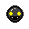

# Baby List

<!-- markdownlint-disable MD033 -->

There are 603 babies in total.

| ID | Appearance | Name | Description |
| -- | ---------- | ---- | ----------- |
| 0 |  | Spider Baby | Shoots a Blue Spider every 2nd tear |
| 1 |  | Love Baby | Spawns a random heart on room clear |
| 2 |  | Bloat Baby | Syringe tears |
| 3 |  | Water Baby | Starts with Isaac's Tears (improved) |
| 4 |  | Psy Baby | Starts with Spoon Bender |
| 5 |  | Cursed Baby | Starts with Cursed Eye |
| 6 |  | Troll Baby | Spawns a Troll Bomb every 3 seconds |
| 7 |  | Ybab Baby | Starts with Analog Stick |
| 8 |  | Cockeyed Baby | Shoots extra tears with random velocity |
| 9 |  | Host Baby | Spawns 10 Blue Spiders on hit |
| 10 |  | Lost Baby | Starts with Holy Mantle + Lost-style health |
| 11 |  | Cute Baby | -1 damage per pickup taken |
| 12 |  | Crow Baby | Soul of Eve effect on hit |
| 13 |  | Shadow Baby | Devil Rooms / Angel Rooms go to the Black Market instead |
| 14 |  | Glass Baby | Orbiting laser ring |
| 15 |  | Gold Baby | Gold gear + gold pickups + gold poops + gold rooms |
| 16 |  | Cy-Baby | Starts with Technology 2 |
| 17 |  | Bean Baby | Constant Butter Bean effect |
| 18 |  | Mag Baby | Confusion tears |
| 19 |  | Wrath Baby | Anarchist Cookbook effect every 7 seconds |
| 20 |  | Wrapped Baby | 5x Kamikaze effect on hit |
| 21 |  | Begotten Baby | Starts with Eve's Mascara |
| 22 |  | Dead Baby | Starts with 2x ???'s Only Friend + blindfolded |
| 23 |  | Fighting Baby | Starts with Bloody Lust |
| 24 |  | -0- Baby | Invulnerability |
| 25 |  | Glitch Baby | Starts with 20x GB Bug |
| 26 |  | Magnet Baby | Magnetizing tears |
| 27 |  | Black Baby | Curse Room doors in uncleared rooms |
| 28 |  | Red Baby | Starts with 5x Distant Admiration |
| 29 |  | White Baby | Starts with Hallowed Ground |
| 30 |  | Blue Baby | Sprinkler tears |
| 31 |  | Rage Baby | Starts with Sad Bombs + golden bomb + blindfolded |
| 32 |  | Cry Baby | Enemies are fully healed on hit |
| 33 |  | Yellow Baby | Lemon Party effect on hit |
| 34 |  | Long Baby | Flat tears |
| 35 |  | Green Baby | Booger tears |
| 36 |  | Lil Baby | Everything is tiny |
| 37 |  | Big Baby | Everything is giant |
| 38 |  | Brown Baby | Starts with Dirty Mind + Dingle Berry + spawns a poop per enemy killed |
| 39 |  | Noose Baby | Don't shoot when the timer reaches 0 |
| 40 |  | Hive Baby | Starts with Hive Mind + max Blue Flies + max Blue Spiders |
| 41 |  | Buddy Baby | Removes a heart container on hit |
| 42 |  | Colorful Baby | Acid trip |
| 43 |  | Whore Baby | All enemies explode |
| 44 |  | Cracked Baby | Starts with Cracked Dice |
| 45 |  | Dripping Baby | Starts with Isaac's Heart |
| 46 |  | Blinding Baby | Spawns a Sun Card on hit |
| 47 |  | Sucky Baby | Succubus aura |
| 48 |  | Dark Baby | Temporary blindness |
| 49 |  | Picky Baby | Starts with More Options |
| 50 |  | Revenge Baby | Spawns a random heart on hit |
| 51 |  | Belial Baby | Starts with Azazel-style Brimstone + flight |
| 52 |  | Sale Baby | Starts with Steam Sale |
| 53 |  | Goat Head Baby | Starts with Goat Head + Number Magnet |
| 54 |  | Super Greed Baby | Midas tears |
| 55 |  | Mort Baby | Guppy tears |
| 56 |  | Apollyon Baby | Black rune effect on hit |
| 57 |  | Bone Baby | Starts with Brittle Bones |
| 58 |  | Bound Baby | Monster Manual effect every 7 seconds |
| 59 |  | Big Eyes Baby | Tears cause self-knockback |
| 60 |  | Sleep Baby | Starts with Broken Modem |
| 61 |  | Zombie Baby | Brings back enemies from the dead |
| 62 |  | Goat Baby | Guaranteed Devil Room + Angel Room after 6 hits |
| 63 |  | Butthole Baby | Spawns a random poop every 5 seconds |
| 64 |  | Eye Patch Baby | Starts with Callus + makes spikes |
| 65 |  | Blood Eyes Baby | Starts with Haemolacria |
| 66 |  | Mustache Baby | Boomerang tears |
| 67 |  | Spittle Baby | Starts with Dead Onion |
| 68 |  | Brain Baby | Starts with The Mind |
| 69 |  | 3 Eyes Baby | Starts with The Inner Eye |
| 70 |  | Viridian Baby | Starts with How to Jump |
| 71 |  | Blockhead Baby | Starts with Dr. Fetus + Soy Milk + explosion immunity |
| 72 |  | Worm Baby | Starts with 5x Little Chubby |
| 73 |  | Lowface Baby | Starts with Book of Virtues + Unicorn Stump |
| 74 |  | Alien Hominid Baby | Beam sword tears |
| 75 |  | Bomb Baby | 50% chance for bombs to have the D6 effect |
| 76 |  | Video Baby | Starts with Tech X |
| 77 |  | Parasite Baby | Starts with The Parasite |
| 78 |  | Derp Baby | Starts with Cube of Meat + BFFS + 0.5x damage |
| 79 |  | Lobotomy Baby | Starts with Delirious |
| 80 |  | Choke Baby | Summons random portals |
| 81 |  | Scream Baby | Shoop tears |
| 82 |  | Gurdy Baby | Starts with 20x Lil Gurdy |
| 83 |  | Ghoul Baby | Book of Secrets effect on hit |
| 84 |  | Goatee Baby | Starts with Death's Touch and Lachryphagy |
| 85 |  | Shades Baby | Starts with X-Ray Vision |
| 86 |  | Statue Baby | Starts with Duality |
| 87 |  | Bloodsucker Baby | Starts with 3x Lil Delirium |
| 88 |  | Bandaid Baby | 50% chance to spawn a random pedestal item on room clear |
| 89 |  | Eyebrows Baby | Starts with 5x Guppy's Hair Ball + flight + blindfolded |
| 90 |  | Nerd Baby | Locked doors in uncleared rooms |
| 91 |  | Boss Baby | Starts with There's Options |
| 92 |  | Turd Baby | Enemies fart on death |
| 93 |  | O Baby | Starts with Tiny Planet |
| 94 |  | Square Eyes Baby | Square tears |
| 95 |  | Teeth Baby | Starts with Lemegeton |
| 96 |  | Frown Baby | Summons Best Friend every 5 seconds |
| 97 |  | Tongue Baby | Recharge bombs |
| 98 |  | Half Head Baby | Takes 2x damage |
| 99 |  | Makeup Baby | 7-shot |
| 100 |  | Ed Baby | Fire trail tears |
| 101 |  | D Baby | Spawns creep on hit (improved) |
| 102 |  | Guppy Baby | Starts with Guppy's Head |
| 103 |  | Puke Baby | Starts with Ipecac |
| 104 |  | Dumb Baby | Starts with No. 2 |
| 105 |  | Lipstick Baby | Range oscillates |
| 106 |  | Aether Baby | All direction tears |
| 107 |  | Brownie Baby | Starts with Level 4 Meatboy + Level 4 Meatgirl |
| 108 |  | VVVVVV Baby | Starts with Anti-Gravity |
| 109 |  | Nosferatu Baby | Enemies have homing projectiles |
| 110 |  | Pubic Baby | Must full clear |
| 111 |  | Eyemouth Baby | Shoots an extra tear every 3rd shot |
| 112 |  | Weirdo Baby | Starts with The Ludovico Technique |
| 113 |  | V Baby | Electric ring tears |
| 114 |  | Strange Mouth Baby | Wiggle tears |
| 115 |  | Masked Baby | Can't shoot while moving |
| 116 |  | Cyber Baby | Spawns a random pickup on hit |
| 117 |  | Axe Wound Baby | Starts with 2x Sacrificial Dagger + flight |
| 118 |  | Statue Baby 2 | Improved Secret Rooms |
| 119 |  | Grin Baby | Starts with Godhead |
| 120 |  | Upset Baby | Starts with Sad Bombs |
| 121 |  | Plastic Baby | Starts with Rubber Cement |
| 122 |  | Monochrome Baby | Starts with Dead Eye |
| 123 |  | One Tooth Baby | Spawn a Bishop on hit |
| 124 |  | Tusks Baby | 2x damage |
| 125 |  | Hopeless Baby | +2 keys + keys are hearts |
| 126 |  | Big Mouth Baby | Starts with 10x Jaw Bone |
| 127 |  | Pee Eyes Baby | Starts with Number One |
| 128 |  | Earwig Baby | 3 rooms are already explored |
| 129 |  | Ninkumpoop Baby | All chests are Old Chests |
| 130 |  | Strange Shape Baby | Pulsing tears |
| 131 |  | Bugeyed Baby | Pickups turn into Blue Spiders |
| 132 |  | Freaky Baby | Converter effect on hit |
| 133 |  | Crooked Baby | Left angled tears |
| 134 |  | Spider Legs Baby | Starts with 15x Sissy Longlegs |
| 135 |  | Smiling Baby | Starts with Sacred Heart |
| 136 |  | Tears Baby | Starts with Paschal Candle |
| 137 |  | Bowling Baby | Starts with Flat Stone |
| 138 |  | Mohawk Baby | +2 bombs + bombs are hearts |
| 139 |  | Rotten Meat Baby | Teleport to starting room on hit |
| 140 |  | No Arms Baby | Pickups are bouncy |
| 141 |  | Twin Baby | Uncontrollable Teleport 2.0 |
| 142 |  | Ugly Girl Baby | Starts with Ipecac + Dr. Fetus |
| 143 |  | Chompers Baby | Everything is Red Poop |
| 144 |  | Camillo Jr. Baby | Starts with Tech.5 |
| 145 |  | Eyeless Baby | Starts with 20x The Peeper |
| 146 |  | Sloppy Baby | Starts with Epic Fetus (improved) |
| 147 |  | Bluebird Baby | Touching items/pickups causes paralysis |
| 148 |  | Fat Baby | Necronomicon effect on hit |
| 149 |  | Butterfly Baby | Improved Super Secret Rooms |
| 150 |  | Goggles Baby | Starts with 20/20 |
| 151 |  | Apathetic Baby | Starts with Diplopia |
| 152 |  | Cape Baby | Spray tears |
| 153 |  | Sorrow Baby | Projectiles are reflected as bombs |
| 154 |  | Rictus Baby | Scared pickups |
| 155 |  | Awaken Baby | Constant Telekinesis effect |
| 156 |  | Puff Baby | Mega Bean effect every 5 seconds |
| 157 |  | Attractive Baby | All enemies are permanently charmed |
| 158 |  | Pretty Baby | All special rooms are Angel shops |
| 159 |  | Cracked Infamy Baby | Starts with Dr. Fetus + Remote Detonator |
| 160 |  | Distended Baby | Starts with Contagion |
| 161 |  | Mean Baby | Starts with Epic Fetus |
| 162 |  | Digital Baby | B00B T00B |
| 163 |  | Helmet Baby | Invulnerability when standing still |
| 164 |  | Black Eye Baby | Starts with Leprosy, +5 damage on Leprosy breaking |
| 165 |  | Lights Baby | Holy tears |
| 166 |  | Spike Baby | All chests are Spiked Chests + all chests have items |
| 167 |  | Worry Baby | Touching items/pickups causes teleportation |
| 168 |  | Ears Baby | Starts with 3x Mystery Sack |
| 169 |  | Funeral Baby | Starts with Death's Touch |
| 170 |  | Libra Baby | 32 seconds of invulnerability on hit |
| 171 |  | Gappy Baby | Destroying machines gives items |
| 172 |  | Sunburn Baby | Starts with Ghost Pepper |
| 173 |  | Ate Poop Baby | Destroying poops spawns random pickups |
| 174 |  | Electric Baby | Starts with Jacob's Ladder |
| 175 |  | Blood Hole Baby | Starts with Proptosis |
| 176 |  | Transforming Baby | Starts with Technology Zero |
| 177 |  | Aban Baby | +2 coins + Sonic-style health |
| 178 |  | Bandage Girl Baby | Starts with Cube of Meat + Ball of Bandages |
| 179 |  | Piece A Baby | Can only move up + down + left + right |
| 180 |  | Piece B Baby | Starts with Charging Station |
| 181 |  | Spelunker Baby | Starts with Stud Finder; Crawlspace --> Black Market |
| 182 |  | Frog Baby | Starts with Scorpio |
| 183 |  | Crook Baby | Starts with Mr. ME |
| 184 |  | Don Baby | Starts with Bob's Brain |
| 185 |  | Web Baby | Slowing tears |
| 186 |  | Faded Baby | Random teleport on hit |
| 187 |  | Sick Baby | Shoots explosive flies + flight |
| 188 |  | Dr. Fetus Baby | Starts with Dr. Fetus |
| 189 |  | Spectral Baby | Starts with Ouija Board |
| 190 |  | Red Skeleton Baby | Starts with 3x Slipped Rib |
| 191 |  | Skeleton Baby | Starts with Compound Fracture |
| 192 |  | Jammies Baby | Extra charge on room clear |
| 193 |  | New Jammies Baby | Starts with 5x Big Chubby |
| 194 |  | Cold Baby | Freeze tears |
| 195 |  | Old Man Baby | Starts with Dad's Key |
| 196 |  | Spooked Baby | All enemies are permanently feared |
| 197 |  | Nice Baby | Brimstone tears |
| 198 |  | Dots Baby | Starts with Cricket's Body |
| 199 |  | Peeling Baby | Starts with Potato Peeler |
| 200 |  | Small Face Baby | My Little Unicorn effect on hit |
| 201 |  | Good Baby | Starts with 15x Seraphim |
| 202 |  | Blindfold Baby | Starts with Incubus + blindfolded |
| 203 |  | Pipe Baby | Starts with Tractor Beam |
| 204 |  | Dented Baby | Spawns a random key on hit |
| 205 |  | Steven Baby | Starts with 20x Little Steven |
| 206 |  | Monocle Baby | 3x tear size |
| 207 |  | Belial Baby 2 | Starts with Eye of Belial |
| 208 |  | Monstro Baby | Starts with 5x Lil Monstro |
| 209 |  | Fez Baby | Starts with The Book of Belial |
| 210 |  | Meat Boy Baby | Potato Peeler effect on hit |
| 211 |  | Skull Baby | Shockwave bombs |
| 212 |  | Conjoined Baby | Doors open on hit |
| 213 |  | Skinny Baby | Super homing tears |
| 214 |  | Basic Spider Baby | Starts with Mutant Spider |
| 215 |  | Shopkeeper Baby | Free shop items |
| 216 |  | Fancy Baby | Can purchase teleports to special rooms |
| 217 |  | Chubby Baby | Starts with Technology Zero + Tiny Planet |
| 218 |  | Cyclops Baby | Starts with Polyphemus |
| 219 |  | Isaac Baby | Starts with The Battery |
| 220 |  | Plug Baby | Starts with Sharp Plug |
| 221 |  | Drool Baby | Starts with Monstro's Tooth (improved) |
| 222 |  | Wink Baby | Starts with Vanishing Twin |
| 223 |  | Pox Baby | Starts with Toxic Shock |
| 224 |  | Onion Baby | Projectiles have 2x speed |
| 225 |  | Zipper Baby | Extra enemies spawn on hit |
| 226 |  | Buckteeth Baby | Starts with 15x Angry Fly |
| 227 |  | Beard Baby | Starts with Ocular Rift |
| 228 |  | Hanger Baby | Starts with Abel; Abel's tears hurt you |
| 229 |  | Vampire Baby | Starts with Contract From Below |
| 230 |  | Tilt Baby | Right angled tears |
| 231 |  | Bawl Baby | Constant Isaac's Tears effect + blindfolded |
| 232 |  | Lemon Baby | Starts with Lemon Mishap (improved) |
| 233 |  | Punkboy Baby | Starts with The Polaroid |
| 234 |  | Punkgirl Baby | Starts with The Negative |
| 235 |  | Computer Baby | Starts with Technology + Technology 2 |
| 236 |  | Mask Baby | All enemies are permanently confused |
| 237 |  | Gem Baby | Pennies spawn as nickels |
| 238 |  | Shark Baby | Starts with 5x Fate's Reward |
| 239 |  | Beret Baby | All champions |
| 240 |  | Blisters Baby | Shot speed oscillates |
| 241 |  | Radioactive Baby | Starts with Mysterious Liquid |
| 242 |  | Beast Baby | Devolves enemies |
| 243 |  | Dark Baby 2 | Starts with Strange Attractor |
| 244 |  | Snail Baby | 0.5x speed |
| 245 |  | Blood Baby | Starts with 5x Forever Alone |
| 246 |  | 8 Ball Baby | Orbiting tears |
| 247 |  | Wisp Baby | Starts with Crack the Sky |
| 248 |  | Cactus Baby | Starts with Locust of Famine |
| 249 |  | Love Eye Baby | Falls in love with the first enemy killed |
| 250 |  | Medusa Baby | Coins refill bombs and keys when depleted |
| 251 |  | Nuclear Baby | Mama Mega effect on hit |
| 252 |  | Purple Baby | Fires are holy |
| 253 |  | Wizard Baby | Most cards are face up |
| 254 |  | Earth Baby | Starts with Fruit Cake |
| 255 |  | Saturn Baby | Starts with Continuum |
| 256 |  | Cloud Baby | Ventricle Razor effect every 15 seconds |
| 257 |  | Tube Baby | Starts with Varicose Veins |
| 258 |  | Rocker Baby | Spawns a random bomb on hit |
| 259 |  | King Baby | Starts with Crown of Light |
| 260 |  | Coat Baby | Spawns a random card on hit |
| 261 |  | Viking Baby | Secret Room --> Super Secret Room |
| 262 |  | Panda Baby | Starts with The Poop (improved) |
| 263 |  | Raccoon Baby | Random rocks |
| 264 |  | Bear Baby | Starts with Mystery Gift |
| 265 |  | Polar Bear Baby | Starts with Lil Brimstone + Robo Baby + Baby Bender |
| 266 |  | Lovebear Baby | Starts with The Relic |
| 267 |  | Hare Baby | Takes damage when standing still |
| 268 |  | Squirrel Baby | Starts with Walnut (improved) |
| 269 |  | Tabby Baby | Starts with Sol |
| 270 |  | Porcupine Baby | Wait What? effect every 5 seconds |
| 271 |  | Puppy Baby | Starts with Cricket's Head |
| 272 |  | Parrot Baby | Starts with The Pony |
| 273 |  | Chameleon Baby | Starts with 5x Rotten Baby |
| 274 |  | Boulder Baby | Starts with Leo |
| 275 |  | Aqua Baby | Starts with Taurus |
| 276 |  | Gargoyle Baby | Head of Krampus effect on hit |
| 277 |  | Spiky Demon Baby | Starts with Dark Arts |
| 278 |  | Red Demon Baby | Starts with Brimstone + Anti-Gravity |
| 279 |  | Orange Demon Baby | Explosivo tears |
| 280 |  | Eye Demon Baby | Enemies have Continuum projectiles |
| 281 |  | Fang Demon Baby | Directed light beams |
| 282 |  | Ghost Baby 2 | Constant Maw of the Void effect + flight + blindfolded |
| 283 |  | Arachnid Baby | Starts with 5x Daddy Longlegs |
| 284 |  | Bony Baby | All bombs are doubled |
| 285 |  | Big Tongue Baby | Flush effect on hit |
| 286 |  | 3D Baby | Starts with My Reflection |
| 287 |  | Suit Baby | All special rooms are Devil Rooms |
| 288 |  | Butt Baby | Farts after shooting |
| 289 |  | Cupid Baby | Starts with Cupid's Arrow |
| 290 |  | Heart Baby | Dull Razor effect every 5 seconds |
| 291 |  | Killer Baby | +0.2 damage per enemy killed |
| 292 |  | Lantern Baby | Godhead aura + flight + blindfolded |
| 293 |  | Banshee Baby | Crack the Sky effect on hit |
| 294 |  | Ranger Baby | Starts with 3x Lil Chest |
| 295 |  | Rider Baby | Starts with A Pony + blindfolded |
| 296 |  | Choco Baby | Starts with Chocolate Milk |
| 297 |  | Woodsman Baby | Meat Cleaver effect on room enter |
| 298 |  | Brunette Baby | Starts with The Poop + Brown Cap |
| 299 |  | Blonde Baby | Starts with Dad's Ring |
| 300 |  | Blue Hair Baby | Starts with The Candle |
| 301 |  | Bloodied Baby | Create red doors on hit + improved Ultra Secret Rooms |
| 302 |  | Cheese Baby | The Bean + Gigante Bean |
| 303 |  | Pizza Baby | Starts with Brown Nugget (improved) |
| 304 |  | Hotdog Baby | Constant The Bean effect + flight + explosion immunity + blindfolded |
| 305 |  | Nature Baby | Starts with Sprinkler |
| 306 |  | Borg Baby | Starts with Teleport 2.0 |
| 307 |  | Corrupted Baby | Touching items/pickups causes damage |
| 308 |  | X Mouth Baby | Moving Box effect on hit |
| 309 |  | X Eyed Baby | Starts with Marked |
| 310 |  | Starry Eyed Baby | Spawns a Stars Card on hit |
| 311 |  | Surgeon Baby | Starts with Ventricle Razor |
| 312 |  | Sword Baby | Starts with Sacrificial Dagger |
| 313 |  | Monk Baby | Starts with Mom's Bracelet |
| 314 |  | Disco Baby | Starts with 10x Angelic Prism |
| 315 |  | Puzzle Baby | D6 effect on hit |
| 316 |  | Speaker Baby | X splitting tears |
| 317 |  | Scary Baby | Items cost hearts |
| 318 |  | Fireball Baby | Explosion immunity + fire immunity |
| 319 |  | Maw Baby | Starts with Maw of the Void |
| 320 |  | Exploding Baby | Kamikaze effect upon touching a breakable obstacle |
| 321 |  | Cupcake Baby | Starts with Voodoo Head + Flat File |
| 322 |  | Skinless Baby | 2x damage + takes 2x damage |
| 323 |  | Ballerina Baby | Summons a Restock Machine after 6 hits |
| 324 |  | Goblin Baby | Extra item after boss if no damage taken on floor |
| 325 |  | Cool Goblin Baby | Starts with 5x Acid Baby |
| 326 |  | Geek Baby | Starts with 20x Robo-Baby 2.0 + blindfolded |
| 327 |  | Long Beard Baby | Starts with 10x Gemini |
| 328 |  | Muttonchops Baby | Starts with Lachryphagy |
| 329 |  | Spartan Baby | Starts with Spirit Sword |
| 330 |  | Tortoise Baby | 50% chance to ignore damage |
| 331 |  | Slicer Baby | Slice tears |
| 332 |  | Butterfly Baby 2 | Flight + can walk through walls |
| 333 |  | Homeless Baby | Starts with 15x Buddy in a Box |
| 334 |  | Lumberjack Baby | Starts with 3x Sack of Sacks |
| 335 |  | Cyberspace Baby | Starts with Brimstone + Spoon Bender |
| 336 |  | Hero Baby | 3x damage + 3x tear rate when at 1 heart or less |
| 337 |  | Boxers Baby | Knockout Drops tears |
| 338 |  | Wing Helmet Baby | Starts with The Ludovico Technique + The Parasite |
| 339 |  | X Baby | Shoots 4 tears diagonally |
| 340 |  | O Baby 2 | Spiral tears |
| 341 |  | Vomit Baby | Must stand still every 10 seconds |
| 342 |  | Merman Baby | Keys spawn as bombs |
| 343 |  | Cyborg Baby | Sees numerical damage values |
| 344 |  | Barbarian Baby | Mama Mega bombs |
| 345 |  | Locust Baby | Starts with 20 Abyss locusts + blindfolded |
| 346 |  | Twotone Baby | Dataminer effect on room enter |
| 347 |  | 2600 Baby | Friend Finder effect on room clear |
| 348 |  | Fourtone Baby | Starts with The Candle + blindfolded + instant recharge |
| 349 |  | Grayscale Baby | Delirious effect every 10 seconds |
| 350 |  | Rabbit Baby | Starts with How to Jump; must jump often |
| 351 |  | Mouse Baby | Coin doors in uncleared rooms |
| 352 |  | Critter Baby | Starts with Infestation 2 |
| 353 |  | Blue Robot Baby | Starts with Berserk |
| 354 |  | Pilot Baby | Starts with Dr. Fetus + Haemolacria |
| 355 |  | Red Plumber Baby | Starts with Locust of War |
| 356 |  | Green Plumber Baby | Starts with Locust of Pestilence |
| 357 |  | Yellow Plumber Baby | Starts with Locust of Conquest |
| 358 |  | Purple Plumber Baby | Starts with Locust of Death |
| 359 |  | Tanooki Baby | Mr. ME effect on hit |
| 360 |  | Mushroom Man Baby | Starts with Magic Mushroom |
| 361 |  | Mushroom Girl Baby | Every 8th tear is a bomb |
| 362 |  | Cannonball Baby | Starts with 15x Samson's Chains |
| 363 |  | Froggy Baby | Starts with Ludo + Brimstone + Wiggle Worm |
| 364 |  | Turtle Dragon Baby | Fiery tears |
| 365 |  | Shell Suit Baby | Starts with Burnt Penny |
| 366 |  | Fiery Baby | Spawns a fire on hit |
| 367 |  | Mean Mushroom Baby | Starts with 5x Sack of Pennies |
| 368 |  | Arcade Baby | Razor blade tears |
| 369 |  | Scared Ghost Baby | 2x speed |
| 370 |  | Blue Ghost Baby | Max tear rate |
| 371 |  | Red Ghost Baby | +10 damage |
| 372 |  | Pink Ghost Baby | Charm tears |
| 373 |  | Orange Ghost Baby | Placed bombs are Mega Troll Bombs |
| 374 |  | Pink Princess Baby | Summons random stomps every 4 seconds |
| 375 |  | Yellow Princess Baby | Starts with Ipecac + Trisagion + Flat Stone |
| 376 |  | Dino Baby | Gains an explosive egg per enemy killed |
| 377 |  | Elf Baby | Starts with Spear of Destiny (improved) + flight |
| 378 |  | Dark Elf Baby | Starts with Bone Spurs + Polished Bone |
| 379 |  | Dark Knight Baby | Starts with 5x Dry Baby |
| 380 |  | Octopus Baby | Black creep tears |
| 381 |  | Orange Pig Baby | Double items |
| 382 |  | Blue Pig Baby | Spawns a Mega Troll Bomb every 5 seconds |
| 383 |  | Elf Princess Baby | Starts with 10x Mom's Razor |
| 384 |  | Fishman Baby | Spawns a random bomb on room clear |
| 385 |  | Fairyman Baby | -30% damage on hit |
| 386 |  | Imp Baby | Blender + flight + explosion immunity + blindfolded |
| 387 |  | Worm Baby 2 | Starts with 20x Leech |
| 388 |  | Blue Wrestler Baby | Enemies spawn projectiles upon death |
| 389 |  | Red Wrestler Baby | Everything is TNT |
| 390 |  | Toast Baby | Enemies leave a Red Candle fire upon death |
| 391 |  | Roboboy Baby | Starts with Technology + A Lump of Coal |
| 392 |  | Liberty Baby | Starts with Azazel's Rage |
| 393 |  | Dream Knight Baby | Starts with Super Bum |
| 394 |  | Cowboy Baby | Pickups shoot |
| 395 |  | Mermaid Baby | Bombs spawn as keys |
| 396 |  | Plague Baby | Leaves a trail of creep |
| 397 |  | Space Soldier Baby | Starts with Void |
| 398 |  | Dark Space Soldier Baby | Chaos card tears (every 5th tear) |
| 399 |  | Gas Mask Baby | Starts with Wait What? |
| 400 |  | Tomboy Baby | Starts with We Need to Go Deeper (uncharged) |
| 401 |  | Corgi Baby | Spawns a fly every 1.5 seconds |
| 402 |  | Unicorn Baby | Starts with Unicorn Stump + Cube of Meat |
| 403 |  | Pixie Baby | Starts with 3x YO LISTEN (improved) |
| 404 |  | Referee Baby | Tomato tears |
| 405 |  | Deal With It Baby | Starts with Teleport |
| 406 |  | Astronaut Baby | Tears have a 5% chance to create a Black Hole effect |
| 407 |  | Blurred Baby | Starts with Ipecac + Ludo + Flat Stone |
| 408 |  | Censored Baby | Starts with Eternal D6 |
| 409 |  | Cool Ghost Baby | Starts with Flock of Succubi |
| 410 |  | Gills Baby | Splash tears |
| 411 |  | Blue Hat Baby | Starts with Blue Map |
| 412 |  | Catsuit Baby | Guppy's Paw effect on hit |
| 413 |  | Pirate Baby | Starts with Treasure Map |
| 414 |  | Super Robo Baby | Starts with Broken Remote |
| 415 |  | Lightmage Baby | Starts with Trisagion |
| 416 |  | Puncher Baby | Starts with 10x Punching Bag |
| 417 |  | Holy Knight Baby | Starts with Eucharist |
| 418 |  | Shadowmage Baby | Starts with Spindown Dice |
| 419 |  | Firemage Baby | Starts with Fire Mind + 13 luck |
| 420 |  | Priest Baby | Starts with Anima Sola |
| 421 |  | Zipper Baby 2 | Starts with Door Stop |
| 422 |  | Bag Baby | Starts with The Swarm |
| 423 |  | Sailor Baby | Starts with The Compass |
| 424 |  | Rich Baby | Starts with 99 cents |
| 425 |  | Toga Baby | Starts with 10x Finger |
| 426 |  | Knight Baby | Starts with 5x 7 Seals |
| 427 |  | Black Knight Baby | Starts with Black Hole |
| 428 |  | Magic Cat Baby | Giga Bomb effect on hit |
| 429 |  | Little Horn Baby | Void tears (every 5th tear) |
| 430 |  | Folder Baby | Swaps item/shop pools + devil/angel pools |
| 431 |  | Driver Baby | Slippery movement |
| 432 |  | Dragon Baby | Starts with Lil Brimstone |
| 433 |  | Downwell Baby | Starts with Eden's Soul |
| 434 |  | Cylinder Baby | Tear size increases with distance |
| 435 |  | Cup Baby | Card Against Humanity on hit |
| 436 |  | Cave Robot Baby | Starts with Hairpin |
| 437 |  | Breadmeat Hoodiebread Baby | Everything is sped up |
| 438 |  | Big Mouth Baby 2 | Mega Mush effect after 6 hits |
| 439 |  | Afro Rainbow Baby | Starts with 20x Rainbow Baby |
| 440 |  | Afro Baby | Starts with D1 |
| 441 |  | TV Baby | Mega Blast effect after 6 hits |
| 442 |  | Tooth Head Baby | Tooth tears |
| 443 |  | Tired Baby | Starts with 10x Cube Baby + Ice Cube |
| 444 |  | Steroids Baby | Forget Me Now on 2nd hit (per room) |
| 445 |  | Soap Monster Baby | Starts with Butter |
| 446 |  | Rojen Whitefox Baby | Shield on hit |
| 447 |  | Rocket Baby | Starts with Super Magnet |
| 448 |  | Nurf Baby | Starts with 3x Rune Bag |
| 449 |  | Mutated Fish Baby | Summons a Sprinkler every 7 seconds |
| 450 |  | Moth Baby | Starts with Soy Milk + Ipecac |
| 451 |  | Buttface Baby | Spawns a Black Poop per enemy killed |
| 452 |  | Flying Candle Baby | Starts with Night Light |
| 453 |  | Graven Baby | Starts with Level 4 Bumbo (improved) |
| 454 |  | Gizzy Chargeshot Baby | Starts with Poke Go |
| 455 |  | Green Koopa Baby | Shoots bouncy green shells |
| 456 |  | Handsome Mr. Frog Baby | Spawns 20 Blue Flies on hit |
| 457 |  | Pumpkin Guy Baby | Starts with Pop |
| 458 |  | Red Koopa Baby | Shoots bouncy & homing red shells |
| 459 |  | Sad Bunny Baby | Accuracy increases tear rate |
| 460 |  | Saturn Baby 2 | Starts with The Ludovico Technique + Strange Attractor |
| 461 |  | Toast Boy Baby | Starts with 5x Friend Zone |
| 462 |  | Voxdog Baby | Shockwave tears |
| 463 |  | 404 Baby | -1 coin/bomb/key on hit |
| 464 |  | Arrowhead Baby | Starts with Technology Zero + Cupid's Arrow |
| 465 |  | Beanie Baby | Starts with Smelter |
| 466 |  | Blindcursed Baby | Invisible tears |
| 467 |  | Burning Baby | Starts with Vasculitis + A Lighter + 40 Luck |
| 468 |  | Cursor Baby | Starts with Pause |
| 469 |  | Fly Baby | Mass splitting tears |
| 470 |  | Headphone Baby | Soundwave tears |
| 471 |  | Knife Baby | Starts with Mom's Knife |
| 472 |  | Mufflerscarf Baby | All enemies get frozen on hit |
| 473 |  | Robbermask Baby | +1 damage per pickup taken |
| 474 |  | Scoreboard Baby | Dies 1 minute after getting hit |
| 475 |  | So Many Eyes Baby | Starts with Mutant Spider + The Inner Eye |
| 476 |  | Text Baby | Starts with Glitched Crown |
| 477 |  | Wing Baby | Starts with White Pony |
| 478 |  | Tooth Baby | Starts with Black Tooth |
| 479 |  | Haunt Baby | Starts with 10x Lil Haunt |
| 480 |  | Imp Baby 2 | Acid tears |
| 481 |  | 32bit Baby | No HUD |
| 482 |  | Adventure Baby | Starts with Moving Box |
| 483 |  | Bubbles Baby | +1 damage per pill used |
| 484 |  | Bulb Baby | Starts with Vibrant Bulb |
| 485 |  | Cool Orange Baby | Summons random missiles |
| 486 |  | Crazy Ghost Baby | Starts with 20x Ghost Baby |
| 487 |  | Cursed Pillow Baby | Every 4th missed tear causes damage |
| 488 |  | Egg Baby | Random pill effect on hit |
| 489 |  | Factory Baby | Starts with Clockwork Assembly |
| 490 |  | Ersatz Baby | Starts with Incubus |
| 491 |  | Funny Baby | Enemies spawn Troll Bombs on death |
| 492 |  | Gamer Baby | Constant Retro Vision pill effect |
| 493 |  | Glittery Peach Baby | Teleports to the boss room after 6 hits |
| 494 |  | Pompadour Baby | Shrink tears |
| 495 |  | Head Kick Baby | Starts with Kamikaze + explosion immunity |
| 496 |  | Horn Baby | Starts with Dark Bum |
| 497 |  | Ichor Baby | Starts with 5x Lil Spewer |
| 498 |  | Ill Baby | Bob's Rotten Head tears |
| 499 |  | Lazy Baby | Random card effect on hit |
| 500 |  | Mern Baby | Double tears |
| 501 |  | Necro Baby | Starts with Book of the Dead |
| 502 |  | Peeping Baby | Starts with 8x Bloodshot Eye |
| 503 |  | Penance Baby | Starts with 3x Sworn Protector |
| 504 |  | Psychic Baby | Starts with Abel; tears come from Abel; 2x damage |
| 505 |  | Puppet Baby | Starts with Salvation |
| 506 |  | Reaper Baby | Spawns a random rune on hit |
| 507 |  | Road Kill Baby | Starts with Pointy Rib x3 + blindfolded |
| 508 |  | Sausage Lover Baby | Summons Monstro every 5 seconds |
| 509 |  | Scribble Baby | Starts with Lead Pencil |
| 510 |  | Star Plant Baby | Starts with Dim Bulb |
| 511 |  | Twitchy Baby | Tear rate oscillates |
| 512 |  | Witch Baby | Starts with Crystal Ball (uncharged) |
| 513 |  | Workshop Baby | Starts with Humbling Bundle |
| 514 |  | Hooligan Baby | Double enemies |
| 515 |  | Half Spider Baby | Starts with 3x Pretty Fly |
| 516 |  | Silly Baby | Constant I'm Excited pill effect |
| 517 |  | Master Cook Baby | Egg tears |
| 518 |  | Green Pepper Baby | Starts with Abyss |
| 519 |  | Baggy Cap Baby | Cannot bomb through rooms |
| 520 |  | Stylish Baby | Starts with Store Credit |
| 521 |  | Found Soul Baby | Starts with a Dark Esau |
| 522 |  | Lost White Baby | Eternal D6 effect on hit |
| 523 |  | Lost Black Baby | Spindown Dice effect on hit |
| 524 |  | Lost Blue Baby | D10 effect on hit |
| 525 |  | Lost Grey Baby | D7 effect on hit |
| 526 |  | Wisp Baby 2 | Starts with Book of Virtues |
| 527 |  | Double Baby | Starts with Flip |
| 528 |  | Glowing Baby | Starts with Monstrance |
| 529 |  | Illusion Baby | Spawns a Crane Game on hit |
| 530 |  | Hope Baby | Starts with Found Soul |
| 531 |  | Solomon's Baby A | Can't shoot right |
| 532 |  | Solomon's Baby B | Can't shoot left |
| 533 |  | Thirteenth Baby | Starts with Modeling Clay |
| 534 |  | Berry Baby | Starts with Red Stew |
| 535 |  | Eyebat Baby | Floors are reversed |
| 536 |  | Baby Is You | Starts with Luna |
| 537 |  | Vessel Baby | Starts with 5x Worm Friend |
| 538 |  | Rock Baby | Starts with Terra |
| 539 |  | Janitor Baby | Starts with Aquarius + Playdough Cookie |
| 540 |  | Meaty Baby | Starts with Mars |
| 541 |  | Pig Baby | Starts with Bloody Gust |
| 542 |  | Pegasus Baby | 3x Keeper's Box effect on room clear |
| 543 |  | Mr. E Baby | Starts with Purgatory |
| 544 |  | Slab Baby | Starts with Bag of Crafting |
| 545 |  | Pog Baby | Starts with Sacred Orb |
| 546 |  | Hive King Baby | Giant cell effect on room clear |
| 547 |  | Pill Ship Baby | Starts with Neptunus |
| 548 |  | Point Baby | SUPERHOT |
| 549 |  | Wyrm Baby | Starts with C Section |
| 550 |  | Bullet Baby | Starts with Rocket in a Jar + golden bomb + blindfolded |
| 551 |  | Purple Horse Baby | Starts with Blessed Penny |
| 552 |  | Koala Baby | Genesis effect after 6 hits |
| 553 |  | Cliff Hanger Baby | Starts with Options? |
| 554 |  | Penguin Baby | Starts with Blood Puppy |
| 555 |  | Kinda Loveable Baby | Spawns a Lovers card on hit |
| 556 |  | Cursed Room Baby | Starts with Holy Mantle + Curse of the Cursed |
| 557 |  | Proto Baby | Starts with Brimstone + Haemolacria |
| 558 |  | Finger Baby | All items from the Secret Room pool |
| 559 |  | Bald Baby | All items from the Boss Room pool |
| 560 |  | Hex Baby | Starts with Eye of the Occult |
| 561 |  | Singing Baby | Starts with Astral Projection |
| 562 |  | Junk Baby | Starts with Binge Eater |
| 563 |  | Lucky Baby | Starts with The Stairway |
| 564 |  | Finger Baby 2 | Starts with Urn of Souls |
| 565 |  | Sucky Baby 2 | Starts with Psy Fly |
| 566 |  | Door Mimic Baby | Starts with Bot Fly |
| 567 |  | Kyuukyuu Baby | Starts with Hungry Soul |
| 568 |  | Moon Jelly Baby | Starts with Saturnus |
| 569 |  | Excelsior Baby | Starts with Revelation |
| 570 |  | Painful Baby | Enemies respawn when reentering a room |
| 571 |  | Pointless Baby | Items are replaced with 6 cards |
| 572 |  | Doleful Baby | Starts with Soy Milk + booger tears |
| 573 |  | Cubic Baby | Starts with Brimstone Bombs + Scatter Bombs |
| 574 |  | Food Reviewer Baby | All items are food items |
| 575 |  | Falling Baby | Starts with Twisted Pair |
| 576 |  | Brother Bobby | Slings Godhead aura (improved) |
| 577 |  | Sister Maggy | Loses last item on 2nd hit (per room) |
| 578 |  | Robo-Baby | Starts with Technology + 3x Robo-Baby |
| 579 |  | Little Gish | All items from the Curse Room pool |
| 580 |  | Little Steven | Starts with 20 Ring Cap + golden bomb + blindfolded + explosion immunity |
| 581 |  | Demon Baby | Free devil deals |
| 582 |  | Ghost Baby | All items from the shop pool |
| 583 |  | Harlequin Baby | Starts with The Wiz |
| 584 |  | Rainbow Baby | Chest per enemy killed |
| 585 |  | Abel | Every 5th missed tear causes paralysis |
| 586 |  | Robo-Baby 2.0 | Starts with Undefined (uncharged) |
| 587 |  | Rotten Baby | Shoots Blue Flies + flight |
| 588 |  | Lil Brimstone | Starts with Brimstone |
| 589 |  | Mongo Baby | All items from the Angel Room pool |
| 590 |  | Incubus | All items from the Devil Room pool |
| 591 |  | Fate's Reward | Items cost money |
| 592 |  | Seraphim | Censer aura |
| 593 |  | Lil Loki | Cross tears |
| 594 |  | Lil Monstro | Starts with Monstro's Lung |
| 595 |  | Boiled Baby | All items from the Ultra Secret Room pool |
| 596 |  | Freezer Baby | Ice tears |
| 597 |  | Lil Abaddon | Starts with Devil's Crown |
| 598 |  | Twisted Baby | Spore tears |
| 599 |  | Esau Jr. Baby | Soul of Jacob and Esau effect on hit |
| 600 |  | Gello | Starts with Gello |
| 601 |  | Siren Shooter | Spawns a pedestal item after 6 hits |
| 602 |  | Invisible Baby | Invisibility |
